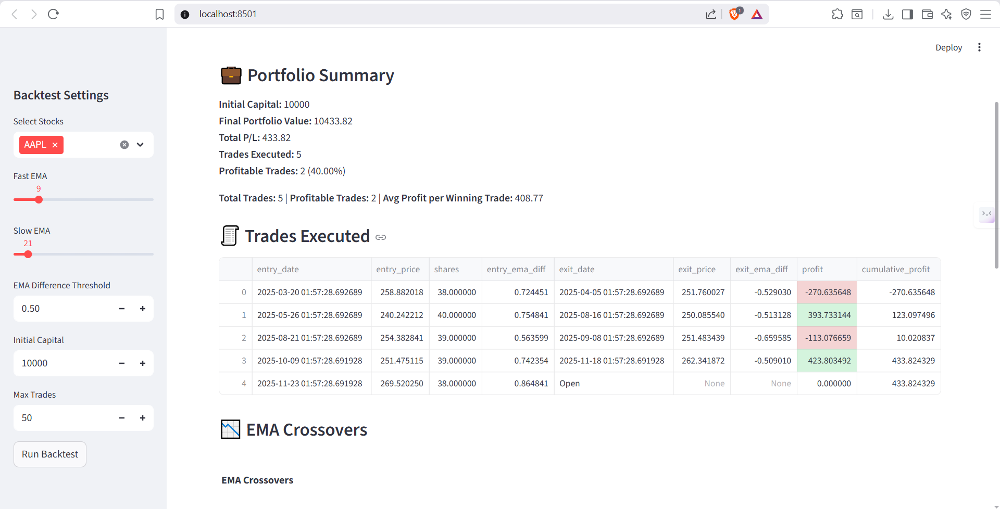

# 📈 EMA Trading Simulator  

A comprehensive Exponential Moving Average (EMA) trading simulator built with Python and Streamlit.  
Learn how EMA-based trading strategies work, visualize trades, and analyze portfolio performance — all in an interactive, educational simulator.


## Overview  

EMA Trading Simulator is designed to let users experiment with EMA-based strategies in a safe, simulated environment.  
It allows: fetching live or cached stock data, applying customizable EMA strategies, executing simulated trades, visualizing buy/sell signals, and tracking portfolio performance.  
Great for learning how moving average strategies work, understanding trading dynamics, or testing new ideas without risking real money.


## Features  

- **Hybrid Data Fetching:**  
  - Fetch live stock data via Yahoo Finance (`yfinance`)  
  - Fallback to cached CSV or synthetic data if live data unavailable  

- **Customizable EMA Strategy:**  
  - Set Fast EMA, Slow EMA, and EMA Difference Threshold  
  - Control initial capital and maximum trades  

- **Trade Analytics:**  
  - Displays executed trades, profit/loss per trade, portfolio summary  
  - Highlights profitable trades  

- **Visualizations:**  
  - EMA Crossover Chart (fast vs slow EMA with buy/sell signals)  
  - Equity Curve (portfolio growth over time)  

- **Educational Explanation:**  
  - Step-by-step guide on EMA strategy logic  
  - Helps understand market trends and signal generation


## How the Strategy Works  

1. **Buy Signal:** Fast EMA > Slow EMA + Threshold → Buy  
2. **Sell Signal:** Fast EMA < Slow EMA - Threshold → Sell  
3. **Profit Mechanism:** Buy low, sell high based on EMA crossovers  
4. **EMA Threshold:** Trades trigger only when trend is significant


##  Project Structure

```bash
ema-trading-simulator/
│
├── src/
│   ├── app.py             # Main Streamlit app
│   ├── data_fetcher.py    # Fetches live/cached/synthetic stock data
│   ├── strategy.py        # EMA strategy logic
│   ├── portfolio.py       # Portfolio management & summary
│   └── utils.py           # Plotting and visualization functions
│
├── data/                  # Cached CSV stock data
├── run.py                 # Entry point
├── requirements.txt       # Python dependencies
└── README.md

```

## Installation & Setup  

### Prerequisites
- Python 3.10+  
- pip  
- Git  

### Install Dependencies
```bash
pip install -r requirements.txt
```

Run the App
```bash
streamlit run run.py
```


## Usage  

- Launch the app using Streamlit  
- Configure Fast EMA, Slow EMA, EMA Threshold, initial capital, and max trades  
- View EMA crossover charts and executed trades  
- Track portfolio performance via equity curve and trade summary  
- Analyze profitable trades visually and numerically


## Screenshots / Demo  

  

## TECH STACK  

**Languages & Frameworks:**  
- Python → core programming, logic, data handling  
- Streamlit → frontend & interactive dashboard  

**Backend / Logic:**  
- EMA strategy calculation (Fast/Slow EMAs, threshold logic)  
- Portfolio management and trade execution  
- Data handling for live/fallback stock data  

**Tools:**  
- Git → version control  
- yfinance → live stock data  
- Pandas, NumPy → data processing  
- Matplotlib / Plotly → charts & visualizations

## LESSONS  

**Programming & Strategy Logic:**  
- Implementing EMA-based trading strategy from scratch  
- Handling edge cases (no trades, threshold conditions)  
- Simulating trades and portfolio updates  

**Data & Analytics:**  
- Fetching live data & handling fallback scenarios  
- Data cleaning, computation of EMAs, and plotting charts  
- Tracking profit/loss per trade and overall equity curve  

**UI / Visualization:**  
- Interactive dashboard with Streamlit  
- Dynamic charts for buy/sell signals and portfolio performance  
- Importance of clear, intuitive visual feedback for users

**Project / Engineering Skills:**  
- Structuring a modular Python project  
- Integrating multiple components (data_fetcher, strategy, portfolio, app)  
- Using Git for version control and incremental development


## Future Roadmap  

- Add support for multiple trading strategies beyond EMA  
- Integrate real-time notifications for signals  
- Portfolio optimization and risk metrics  
- Export trade history and equity curve to CSV/Excel  
- Enhance UI/UX with more interactive charts and custom themes


## Contributing  

Contributions are welcome!  
- Fork the repo  
- Create a new branch (`git checkout -b feature/my-feature`)  
- Commit your changes (`git commit -m "Add my feature"`)  
- Push to branch (`git push origin feature/my-feature`)  
- Open a Pull Request  

Ensure code style consistency and include testing steps in your PR message.

## License

This project is licensed under the MIT License.

